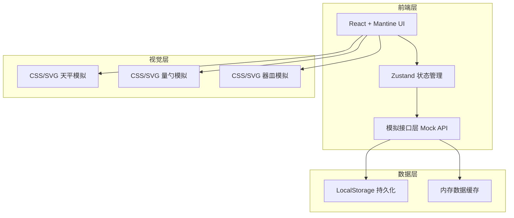
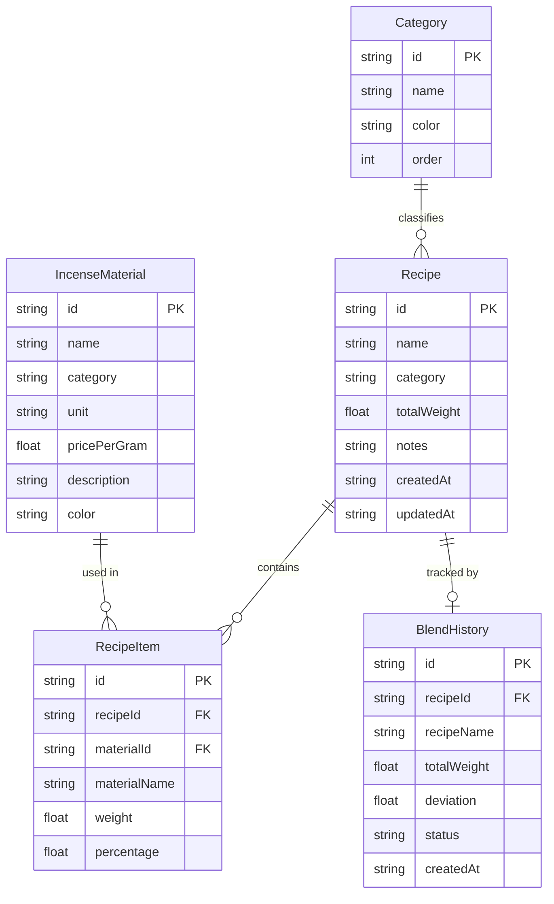

## 1. 架构设计



## 2. 技术说明

- 前端：React@18 + Mantine UI@7 + TypeScript + Vite
- 初始化工具：vite-init (react-ts 模板)
- 状态管理：Zustand
- 数据持久化：LocalStorage（通过模拟接口层封装）
- 后端：无（纯前端应用）
- 样式方案：Mantine UI 主题定制 + CSS Modules 补充

## 3. 路由定义

| 路由 | 用途 |
|------|------|
| / | 工作台页面：天平称量、量勺取料、器皿展示、配比调试 |
| /recipes | 配方管理页面：配方列表、分类管理、一键套用 |
| /history | 历史记录页面：配比历史时间线、详情回溯、配方对比 |

## 4. API 定义（模拟接口）

### 4.1 香材接口

```typescript
interface IncenseMaterial {
  id: string;
  name: string;
  category: 'wood' | 'herb' | 'flower' | 'resin' | 'mineral' | 'other';
  unit: 'g';
  pricePerGram?: number;
  description?: string;
  color: string;
}

interface MaterialAPI {
  getAll(): Promise<IncenseMaterial[]>;
  getById(id: string): Promise<IncenseMaterial | null>;
  add(material: Omit<IncenseMaterial, 'id'>): Promise<IncenseMaterial>;
  update(id: string, material: Partial<IncenseMaterial>): Promise<IncenseMaterial>;
  delete(id: string): Promise<void>;
}
```

### 4.2 配方接口

```typescript
interface Recipe {
  id: string;
  name: string;
  category: string;
  items: RecipeItem[];
  totalWeight: number;
  notes?: string;
  createdAt: string;
  updatedAt: string;
}

interface RecipeItem {
  materialId: string;
  materialName: string;
  weight: number;
  percentage: number;
}

interface RecipeAPI {
  getAll(): Promise<Recipe[]>;
  getById(id: string): Promise<Recipe | null>;
  getByCategory(category: string): Promise<Recipe[]>;
  save(recipe: Omit<Recipe, 'id' | 'createdAt' | 'updatedAt'>): Promise<Recipe>;
  update(id: string, recipe: Partial<Recipe>): Promise<Recipe>;
  delete(id: string): Promise<void>;
}
```

### 4.3 历史记录接口

```typescript
interface BlendHistory {
  id: string;
  recipeId?: string;
  recipeName: string;
  items: RecipeItem[];
  totalWeight: number;
  deviation: number;
  status: 'normal' | 'warning' | 'error';
  createdAt: string;
}

interface HistoryAPI {
  getAll(): Promise<BlendHistory[]>;
  getById(id: string): Promise<BlendHistory | null>;
  add(history: Omit<BlendHistory, 'id' | 'createdAt'>): Promise<BlendHistory>;
  delete(id: string): Promise<void>;
  clear(): Promise<void>;
}
```

### 4.4 分类接口

```typescript
interface Category {
  id: string;
  name: string;
  color?: string;
  order: number;
}

interface CategoryAPI {
  getAll(): Promise<Category[]>;
  add(category: Omit<Category, 'id'>): Promise<Category>;
  update(id: string, category: Partial<Category>): Promise<void>;
  delete(id: string): Promise<void>;
}
```

## 5. 服务器架构图

不适用（纯前端应用，无后端服务）

## 6. 数据模型

### 6.1 数据模型定义



### 6.2 数据存储语言

使用 LocalStorage 键值对存储，数据以 JSON 格式序列化：

- `incense_materials`: 香材列表
- `recipes`: 配方列表
- `blend_history`: 调配历史
- `categories`: 分类列表

初始化时若键不存在，自动注入预设数据（含12种常见香材、3个默认分类、2个示例配方）。
